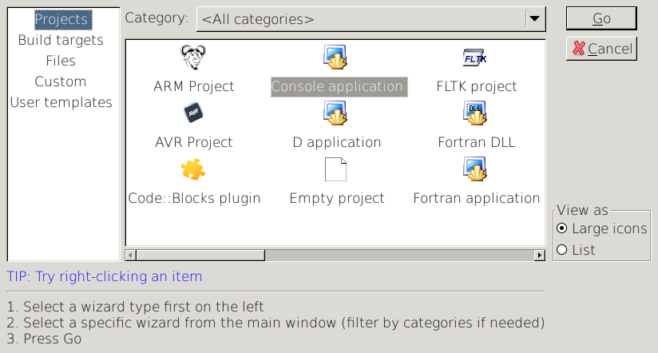

# Introduction to Programming with Modern C++

<div style="border:1px solid black;">
This is an early draft of this tutorial.

You're welcome to give hints and suggest corrections, but take care that most of the chapters are not redacted, yet.
</div>

C++ is probably not the best language for getting your first programming experiences. Some say that Python is the perfect introductory language, but – as often in programming – opinion diverges.

If you did not stop reading that first paragraph, you probably have a good reason for picking C++ and we will try to help you achieve your goal in the fastest and less painful way.

One warning, before we start: this tutorial does not try to introduce you to the full power of C++, it provides you a gentle and coherent introduction to programming with modern C++.

You cannot fully understand the previous paragraph and even  when you're done with this tutorial, you will only partially understand it: C++ is one of the largest programming language, with a long history. And there numerous ways of writing C++ code. Some says that the are as many ways as projects using C++. We had to make a choice.

## How to use this tutorial

- Read it from the beginning to the end.
- Don't worry, if you do not understand all the points in this list: come back and read the unclear ones again after each chapter. Until you're fine with all of them.
- Type, compile, execute and modify all the examples you see.
- Create a directory where you will put – in subdirectories – all the code you write while reading this tutorial. Put that directory under version control.
- Towards the end of this tutorial you will find a chapter with a list of typicall errors: if you get stuck with messages you don't understand from the compiler, you can jumpt there and have a look at it.
- We aim at always being correct, consistent, but not complete:
  - We always use the correct terms, even if sometimes they are not so common for a beginner.
  - In the code snippets, we always use the same syntax and style throughout the manual, even if sometimes there are shortcuts that could be handy.
  - There are numerous way of doing the same thing: you will often have to learn a few different ways in order to understand other people's code. But that's outside of the scope for this introductory manual.
- If somebody more skilled than you tells you to do something differently than what is written in here, just follow her advice. She probably has good reasons.
- We use a microscope icon for facultative information, mostly a bit more advanced than the current chapter.
  
- We use a head brain with engine, for important things, things your have to think about.


## Install the development environment

Depending what is alread installed on your computer, there are different ways of getting ready for programming in C++.

What you need is:

- A programmers text editor or an IDE (Integrated Development Environment) that lets you type the code.
- A compiler that translates the code you have typed in the machine code the computer can execute.
- A way to trigger the compilation and the execution of your code (a button in the text editor/IDE or a terminal/console).

We suggest to install and use [Code::Blocks](http://www.codeblocks.org):

- It's a light weight IDE that is quickly installed on any computer.
- It comes with all you need for compiling and executing your code.

If you have reasons to use any other tool, you're welcome to do so.

A couple of remarks:

- On Windows, install the "mingw-setup" version.
- On Windows, if somebody told you to install Visual Studio, just do it! It's a good IDE, but it will take longer to install and to get used to.
- On Mac you might want to use X Code, since only an old version of Code::Blocks is available.
- On Linux simply install Code::Blocks through your package manager.
- You can, of course, compile and run the code from a terminal / console, if you prefer to do so.

If you need more help for installing Code::Blocks, see the chapters at the end of this tutorial.

Once you have correctly installed Code::Blocks, it's time to start it.

TODO: what happens on first start?

## Creating a project

Normally, it's a good habit to create a project for each programm you write.

In its simplest form, a project is a directory where you put all the code you create for the project.

A project directory should:

- Contain a `README.md` file where you explain what the code does and where you keep your notes.
- Contain a `main.cpp` file where you write your code.
- Be under version control (git), one repository per project.

For this tutorial you can create a new directory, with its `README.md` file. For each chapter, you should type, compile, execute, and modifiy yourself the code you will see: create one subdirectory for each chapter and put add the `.cpp` files in there.


One remark: If you're starting with programming, you're probably not familiar with the version-control system (VCS) commonly in use. We recommend that in parallel to learning C++, you also learn about a VCS like git.

If you're using Code::Blocks, you can create your first "Hello World" project (it's a long time habit to call the first project you do in a programming language "Hello World"...) by:

- File > New > Project and pick "Console application" as the type for the project.  
  
- Choose the C++ language:  
  
- Define the place where the project will be:  
  
 - with the title "hello-world"
 - Pick a folder where the project will be (typically, the `code` directory in your `Documents` directory)
- leave the compiler options as they are  

- and you now should see:  
  
- In your `Documents/code` directory you should now have a `hello-world` directory with two files:
  - `hello-world-cbp`: the Code::Blocks project file.
  - `main.cpp`: the main file where you will write your first program very soon.


## Your first program

It's now time to write your first program.

Double click on `main.cpp` in `Sources`. You should get some code already written for you by Code::Blocks.

It's not bad for a start, but we will start even simpler. Delete everything from the file and replace it with the three lines of code below.

The simplest C++ program looks like this:

```cpp
int main()
{
}
```

This program contains one single function called _main_: the C++ compilers looks for a function declared as `int main()` and uses it as the starting point for the program.


<div style="border:1px solid black;">
A function is a group of statements that get some arguments, performs a task and returns a result.  
</div>

In one of the next chapters, we will learn more about functions.  
But you might already want to know what about the code you just typed. Here is a very short description of the `int main()` function:

- it returns an integer value (`int`),
- it is called "main",
- it has no arguments (the list in the round brackets is empty),
- its body – the statements that perform the task – is enclosed in curly braces `{}` (in our case we do nothing, so the body is empty).


In Code::Blocks, you can run the program by clicking on the "Run" button in the toolbar: if you don't have typos in your program, a window will popup:

```

Process returned 0 (0x0)   execution time : 0.003 s
Press ENTER to continue.
```

Your program did nothing in 0.003 seconds: pretty fast, isn't it?

As soon as you press on your keyboard's Enter key, the window will close.


If you feel overwhelmed, don't worry: we will get back to all of this later. This is what you should retain from this chapter:

- In every program you need to declare an `int main()` function and then put your code in its body, delimited by curly braces (`{}`).
- You should know how to compile and run a simple program: if you're using Code::Blocks, that's the "Run" button.

## The Vending Machine

In every Swiss train station you'll find a red "Vending Machine" with super powers that will convince you to put lot of coins in there, in exchange of sugar processed in different states.

During this tutorial you will create – step by step – a similar vending machine that:

- asks the user to select a product,
- shows the price,
- accepts different coins, and
- gives change.

We will not build a real vending machine, just simulate it in your computer.

## The standard output

When you write a program, you always want it to tell something to the user. Most users expect a graphical user interface, but from a programmer's point of view, the simplest way to do so is by using the standard output:

```cpp
#include <iostream>

int main()
{
    std::cout << "Hello World";
    std::cout << std::endl;
}
```

When programming with Code::Blocks, the standard output is the window that pops up, when you press the "Run" button.  

Type the code above and, when you run it, you will see in the output window:

```
Hello World

Process returned 0 (0x0)   execution time : 0.003 s
Press ENTER to continue.
```

The text "Hello World" has been reproduced in the output window.

How does it work?

In C++, `std::cout` (character output) is the global object controlling the the standard output stream: by writing characters to it, you get them to be displayed – in your case – in the Code::Blocks output window.

Since `std::cout` is not included in the _core_ language but is provided by the _iostream_ (Input Output Stream) standard library, we have to first make it available with the `#include <iostream>` instruction.

In the body of `int main()` function we have two statements:

- First you use the `<<` operator to put the 13 characters of `Hello World` into the `std::cout`.
- Then you use the same `<<` operator to put the end of line character (`std::endl`: "end the line and flush") after the `Hello World` string.


Write about the string litteral being encloses by double quotes.


 
Of course you can both output statements in one line:

```cpp
std::cout << "Hello World" << std::endl;
```

This is even the way, you normally would do.

As we will see in the next chapter, C++ is very picky about the type of the values, but you can put very different types, one after the other, into the standard output:

```cpp
std::cout << "We have " << 2 << " eggs" << std::endl;
```

This might seem trivial to you, but – as an example – in C++ you are often not allowed to "simply" combine values of different types, like text and numbers.

## The Vending Machine: show the products list

You still have learned very little about C++ programs, but you are alread able to program the first lines of code for the Vending Machine.

Vending machine: write the code that outputs:

```
001 - 2 Donuts
002 - 3 dl Brown Soft Drink
003 - 1 Lollipop Candy
```

You might have guessed it: This feels repetitive and very unflexible: There must be better ways to define and output this list!  
Still, when programming, it's often a good idea to start coding what you already know will work and iteration after iteration improve the code untile it contains all the needed features. At the end it's very likely that none of the code you wrote at the beginning will still be there: during the first steps, don't hesitate to rewrite and replace old code.


## Variables, data types and operators


Technically speaking, a variable is a portion of memory for storing a value and identified by a name.

In C++, each variable must have a name, a value and a type.

On a more practical side, a variable is name you attach to a value. As an example if we need to do calculation with triangles we can define:

```cpp
int main()
{
    int base{5};
    int height{4};
    int area{base * height / 2};
    std::cout << "Triangle area: " << area << std::endl;
    height = height * 2;
    area = base * height / 2;
    std::cout << "Triangle's new area: " << area << std::endl;
}
```

Since we have picked good names, you should easily understand what's going on:
- We have three variables, `base`, `height` and `area` of type `int`.
- Each variable is initialized with a value.
- The area is calculated as a multiplication of the base and height.
- We double the height, and then assign a new value calculated to the `area` variable.

All variable above are of type `int`, integer numbers. Variables can contain numbers, text, lists, booleans and many other types.

### Numbers

In real life we recognize numbers when we see them. Sometimes they confound us...


... or we get scared when we see lot of numbers.


Numbers is a big family with many differences. Each type has different qualities.
There are many type of numbers. 

A very special type of number are booleans values: they can always be `1` or `0` or, better `true` or `false`.


```cpp
#include <iostream>
#include <complex>
#include <cmath>

int main() {
    std::complex<double> i;
    std::complex<double> a;
    double pi;
    pi = 2 * asin(1);
    i = -1;
    i = sqrt(i);
    a = exp(2 * pi * i);
    std::cout << "i is " << i << " and Euler was right: e(i pi) = " << a << std::endl;
} 
```

Source: https://stackoverflow.com/a/17926277/5239250

- The `complex` module defines the `std::complex` data type, used to represent complex numbers.
- In the `cmath` module contains the mathematical function like `asin`, `sqrt`, and `exp`.


### Text

### Lists

### Constants

### Naming variables

The naming of variables is subject to

- mandatory rules specified by the C++ standard (the _must_ rules in the list below)
- optional rules specified by a team (the _should_ rules we apply to the code in this book; more on this in the "Code Style" chapter).


- Must start with a letter (should be a latin letter without diacritics) or an underline (`_`). The first letter should be lowercase.
- Only contains letters (`a-z`, should be without diacritics and lowercase), numbers or `_`.
- If it contains full words, they are usually separated by an underscore (`_`).
- The case differences are relevant: `ZIP_code` and `zip_code` are two distinct variables but you should avoid picking names that only differ in the case. 
- You must avoid clashes with the C++ reserved words (you cannot name a variable `if`).
- The name of the variable should describe the meaning of the value (the `age` variable will contain a number with the age).

The principles behind the these rules apply to the naming of most 

### Notes

- int, float, ... and short, long long long... and unsigned
- std::string
- std::vector
- bool?
- time?

- declaration: introduce a new name.
- definition: sets the types and reserve the memory for storing the value.
- initialization: set the initial value of the variable.

The rule is: while it's possible to 

litteral string: c strings or std::strings

how to say that a 4 is a short int and not a long one? most of the time the compiler will figure it out, but, sometimes you want to tell it explicetely.

example from chrono with minutes and seconds? ... probably not here but in "fun" chapter about litterals. (and now, something that is not needed at this point, but is fun to look at)


```cpp
#include <string>
using namespace std::string_literals
int main()
{
    auto text = "Hello World"s;
}
```

auto

operators:

- int: +, -, \*, /, %
- string: +
- +=, -=, \*=, /=

constants

- name in all uppercase
- does not change after initialization.

## Functions

First create a new function.

The main function is special.

Just one remark: it's very unusual that the `int main()` declaration says that the function returns an integer, but the function actually returns nothing. In fact, for `int main()` the compiler automatically returns `0`, if nothing else is defined.

- The type of the result – the return value – is an integer number (`int`). Since we are not defining a result, the compiler will make sure that `0` is returned. This only applies 


- https://en.cppreference.com/w/cpp/language/function

## The C++ language and the standard library

We have already seen iostream, string, vector: now, very short about the concept behind it.

## Standard input

As you will discover soon enough, this not the best way of "communicating" with programs. But, as for the standard output, for a programmer's point of view, this is the simplest one to learn.

## Finding the errors in your code

## Code::Blocks configuration

- in Settings Editor > Source formatter, set the style to "Strustrup"

## Branching: if, else and the logical operators

## Loops: while and for

## Unit testing

Unit testing is about testing parts (units) of your code with a specific, tailred, set of data.

Ensuring that what you do is right.

assert, string and functions

https://gist.github.com/aoloe/5431de9056897d498c639cc179137be2

```cpp
#include <iostream>
#include <string>
#include <cassert>

std::string get_age_group(int age)
{
    std::string age_group{};

    if (age < 18) {
        age_group = "young";
    } else {
        age_group = "old";
    }
    return age_group;
}

int main()
{
    std::string age_group_01 = get_age_group(12);
    assert(typ_01 == "young");

    std::string age_group_02 = get_age_group(19);
    assert(typ_02 == "alt");

    int age{0};
    std::cout << "Age? ";
    std::cin >> age;
    std::cout << get_age_group(age) << std::endl;
}
```

## The containers

## Reading and writing text files

## Classes and objects

## Header files

## Compiling, linking, executing

## The preprocessor

Early in this manual we have introduced the `#include` instructions, without really explaining what it's about.

https://en.cppreference.com/w/cpp/preprocessor

## C++

Statically typed
Natively compiled
Deterministic object lifetime
Pay for what you use

Multi-paradigm
- object oriented
- generic
- functional
- procedural

- deterministic destruction (real time)

### What are the reasons for learning C++?

C++ is a system and applications programming language.

## Things on purpose not in this tutorial, but which you will probably see in examples in code and examples

### C

### using namespace std

## Code Style

Variables:

- Although the C++ standard allows about any unicode letter to be used for naming variable, functions and classes, most compilers and editors still fail to support this feature: for now you should really limit your self to the boring latin letters between a and z... with no diacritics.
- It is also possible to separate the words by capital letters instead of underscores.

## Typical errors

## Installing Code::Blocks on Windows

- Download
- Setup

## Installing Code::Blocks on Mac Os

## Installing Code::Blocks on Linux

### Write simple code

Simple code is:

- expressive,
- readable,
- understandable
- unsurprising
- transparent
- self explanatory
- reassuring
- pleasant

- https://cppcon.org/plenary2018-2/ / https://www.youtube.com/watch?v=n0Ak6xtVXno

## The C heritage
